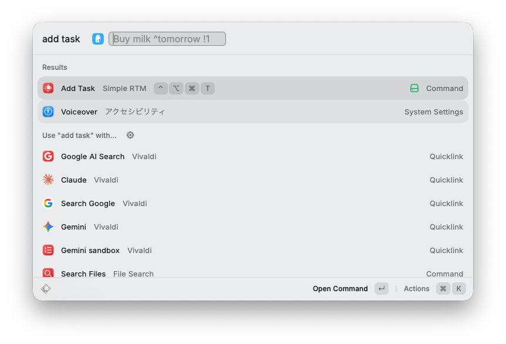

# Simple RTM

A [Raycast](https://raycast.com) extension to quickly add tasks to [Remember The Milk](https://www.rememberthemilk.com/).

## Features

- Add tasks to Remember The Milk directly from Raycast
- Supports [Smart Add](https://www.rememberthemilk.com/help/?ctx=basics.smartadd.whatis) syntax — set due dates, priorities, tags, and more inline (e.g. `Buy milk ^tomorrow !1 #errands`)

## Setup

1. Install the extension
2. On first run, you'll be prompted to authorize your Remember The Milk account in your browser

## Usage

1. Open Raycast and type `Add Task`
2. Enter your task using [Smart Add](https://www.rememberthemilk.com/help/?ctx=basics.smartadd.whatis) syntax:
   - `^tomorrow` — due date
   - `!1` — priority (1 = high, 2 = medium, 3 = low)
   - `#errands` — tag
   - `=15min` — time estimate
3. Press Enter to add the task
